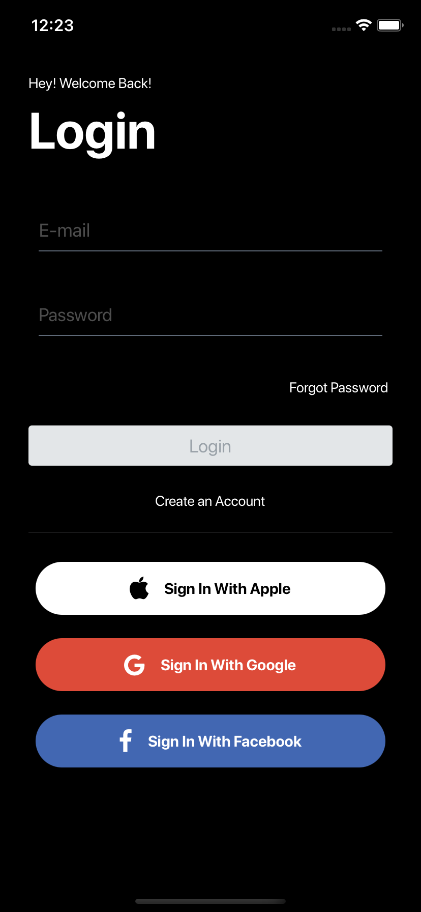
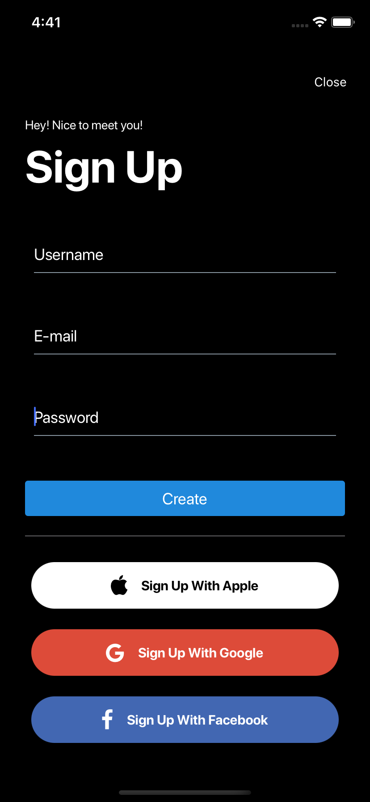
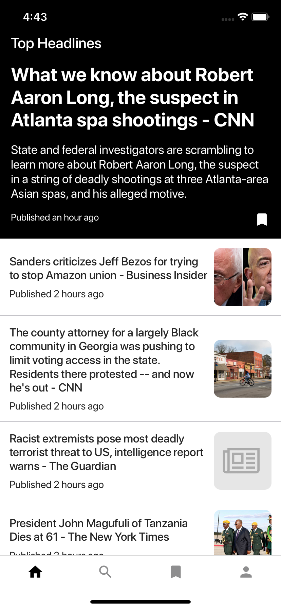
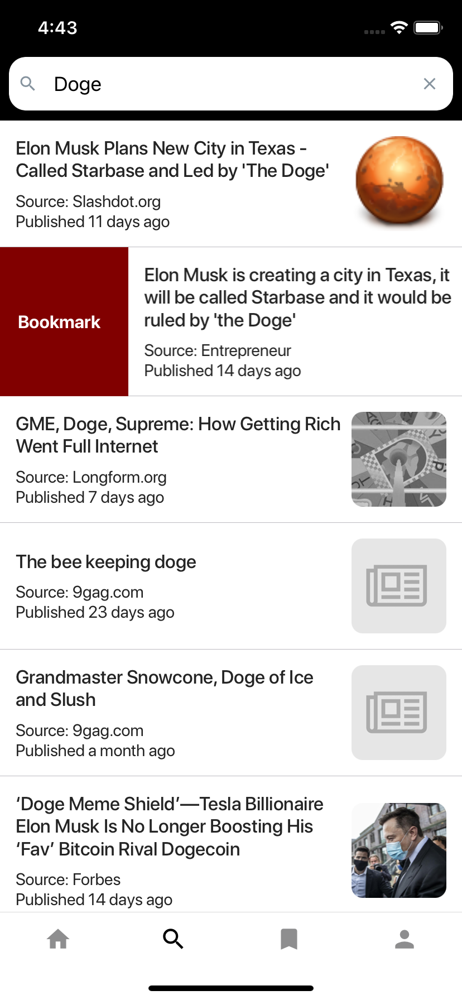
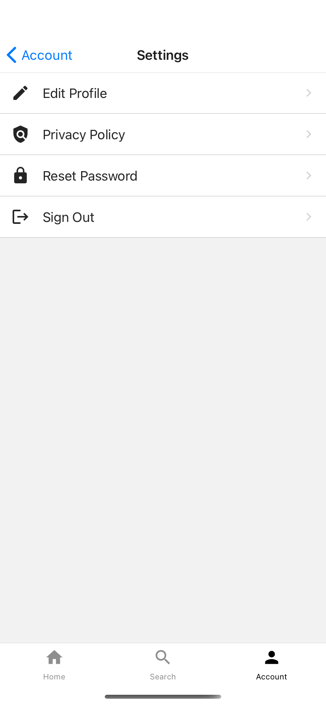
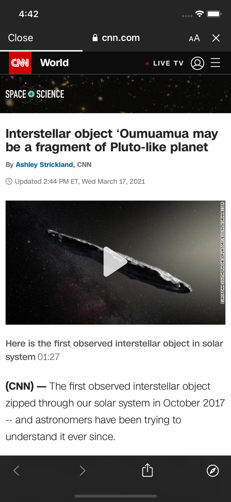
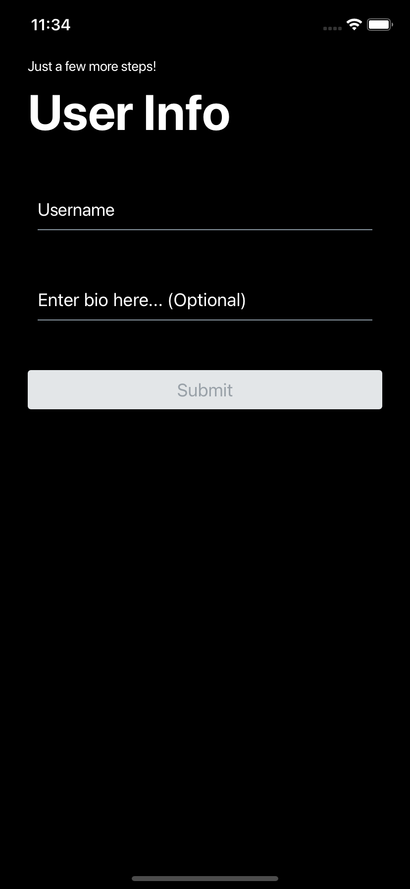

# Today

Today is a cross-platform cloud-enabled mobile application powered by React Native (Front-End) and Google Firebase (Back-End).

The application was built with simplicity in mind and help deliver the latest news. 

The app uses an easy to use UI so that only necessary information is displayed. Making it easier for one to find the top headlines, or search for news articles in a quick and efficient mannar. 

| Login                                                 | Sign Up                                                |
| ----------------------------------------------------- | ------------------------------------------------------ |
|  |  |

| Home                                                     | Search                                                     |
| -------------------------------------------------------- | ---------------------------------------------------------- |
|  |  |

| Settings                                                     | In-App Browser                                                 |
| ------------------------------------------------------------ | -------------------------------------------------------------- |
|  |  |

| More Information                                         |     |
| -------------------------------------------------------- | --- |
|  |
This page will only appear when a user sign's up with a third party such as google or apple
|

### Authenthication Methods
- [x] Email & Password
- [x] Google Sign In
- [x] Apple Sign In

## App Features

### How To View The Latest Headlines
  - Start by creating an account.
  - If you used a third party sign in then you will be prompted to enter additional information such as username and an optional bio. This will not be prompted if you created an account using email and password. 
  - You will then be navigated to the home page this will contain the latest headlines based on the US. A future update will allow the user to choose a country as well as the news sources to filter by.

### Search For An Article
- Once logged in you head to the seach tab
- You will then be able to search for particular news articles. 
- If any found a list will be displayed. Click on either the title or image in order to open up the built-in browser.

### Settings
- Once logged in head over to the Account tab.
- There you will find a settings button. 
- That will navigate you to the settings page where you will be able to edit your profile information, view privacy policy, reset password, or sign out.
- More feature will be added to the settings page in a future update.

## Database
  - Powered By Google Firebase:
    - Authenticaion
    - Firestore Database

You can also:
  - Edit profile
  - Reset password

### API
  - Powered by Firebase Database

>Today uses Firebase Database as the backend in order to store user bookmarks and user details. 

### Open Source Projects
Today uses a number of open source projects to work properly:

  - [React Native] - React Native combines the best parts of native development with React, a best-in-class JavaScript library for building user interfaces.
  - [React Native Firebase] - React Native Firebase is the officially recommended collection of packages that brings React Native support for all Firebase services on both Android and iOS apps.
  - [React Native Elements] - Cross Platform React Native UI Toolkit
  - [React Hook Form] - Performant, flexible and extensible forms with easy-to-use vali
  - [React Query] - Fetch, cache and update data in your React and React Native applications all without touching any "global state".
  - And Others...
### Mobile Application Installation

| Android     | iOS         |
| ----------- | ----------- |
| In-progress | In-progress |

Application in progress of being uploaded to both the iOS and Android App store.

### Todos
  - Write MORE Tests
  - Implement profile pictures
  - Add smoother transitions/animations. 
  - Add ability to create bookmarks
  - Add more features

  [react native]: <https://reactnative.dev>
  [react native firebase]: <https://rnfirebase.io/>
  [react native elements]: <https://reactnativeelements.com/>
  [react hook form]: <https://react-hook-form.com/>
  [react query]: <https://react-query.tanstack.com/>

  
